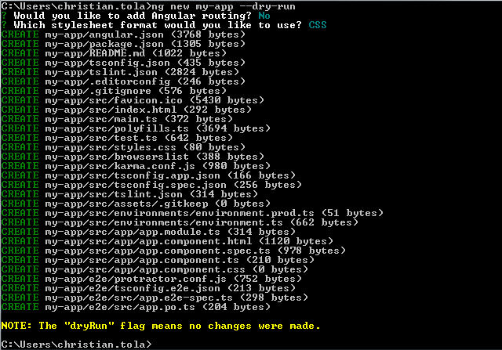

# Comandos en Angular CLI

<Info />

En este post veremos mas a profundidad los comandos que el Angular CLI nos ofrece y su uso.

## Lista de Comandos

Angular CLI nos provee una gran variedad de comandos, desde comandos para generar componentes hasta comandos para preparar nuestra aplicación para producción.
Veamos algunos de los comandos mas útiles:

### Crear un proyecto

Para generar un nuevo proyecto de angular utilizamos el comando ***ng new*** y asignándole un nombre al proyecto a generar y las opciones a utilizar

```bash
ng new <name> <options>
```

Cada comando en angular tiene una lista de opciones que se pueden usar a continuación, para ver la lista de comandos utilice el flag --help luego del nombre del proyecto
```bash
# Lista la ayuda disponible y la lista de todas las opciones del comando utilizado
ng new <name> --help
```

Las opciones mas importantes las describiremos a continuación:

#### --dry-run

Cuando ejecutamos el comando new (o cualquier otro comando) con este flag activo, no se realizan cambios reales dentro del proyecto, este comando nos permite ver las modificaciones que realizara, esto es util para ver que generara el CLI, y comprobar si es lo que se espera.

```bash
# sintax
ng new <name> --dry-run
# sample
ng new my-app --dry-run
```
El resultado es el siguiente:



Al final un warning nos dice que no se ha ejecutado ningún cambio.

#### --inline-style, --inline-template

Los flags --inline permiten agregar los estilos o los template directamente dentro del componente.

```bash
# estilos en linea
ng new <name> --inline-style
# templates en linea
ng new <name> --inline-template
```
#### --prefix

#### --routing

#### --skip-git

#### --skip-install

#### --tests

#### --style

#### --minimal

#### --directory

#### --defaults

```bash
--collection
--commit
--create-application
--defaults
--directory
--experimental-ivy
--force
--help
--interactive
--minimal
--new-project-root
--prefix
--routing
--skip-git
--skip-install
--skip-tests
--style
--verbose
--view-encapsulation
```