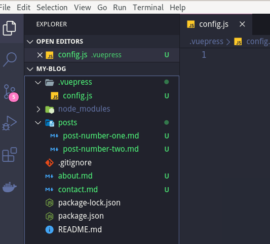
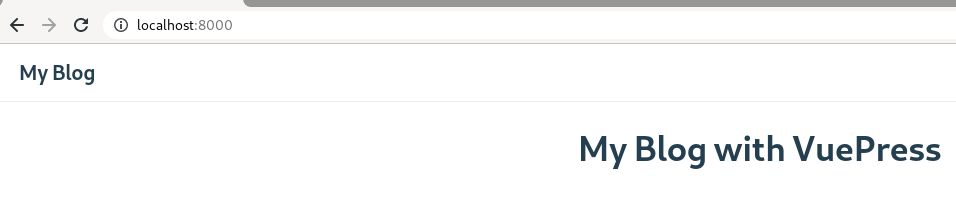
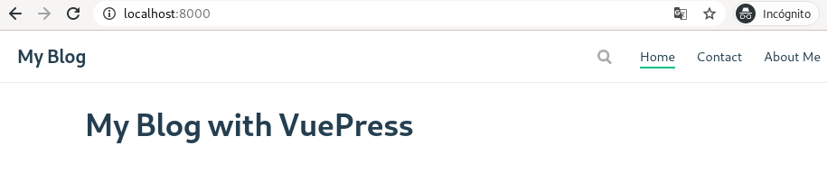

# Archivo de Configuracion y Rutas con VuePress

<Info />

<Banner url="BannerTemplateVuePress.jpg" alt="Blog con Vue.js"/>

En este segundo articulo sobre vuepress, veremos el manejo de rutas y el archivo de configuracion con vuepress.

Como vimos en el anterior [post](/blog/create-vuepress-blog.html), para escribir la pagina de nuestro blog agregamos un archivo **README.md** que se renderiza como la raiz de nuestro sitio (o nuestro _index.html_), pero ¿que pasa si necesito agregar nuevas rutas?, la respuesta esta en la forma de como vuepress estructura sus archivos.

## Estructura de Archivos

Un Proyecto en vuepress tiene la siguiente estructura.

```md
.
├── .vuepress (Optional)
│ ├── components (Optional)
│ ├── theme (Optional)
│ │ └── Layout.vue
│ ├── public (Optional)
│ ├── styles (Optional)
│ │ ├── index.styl
│ │ └── palette.styl
│ ├── templates (Optional, Danger Zone)
│ │ ├── dev.html
│ │ └── ssr.html
│ ├── config.js (Optional)
│ └── enhanceApp.js (Optional)
│
├── README.md
├── contact
│ └── README.md
├── about
│ └── README.md
│
└── package.json
```

Tenemos un folder llamado **.vuepress** que es donde guardaremos todos los archivos necesarios y de configuracion, que necesitamos para darle mas funcionalidad a nuestro blog, recordemos que nuestro blog esta basado en vue.js y podemos crear y utilizar componentes de vue para darle mas funcionalidad.

Fuera de la carpeta de configuracion vuepress se encuentra todo el contenido de nuestra aplicacion:

```md
│
├── README.md
├── contact.md
├── about.md
├── posts
│ └── README.md
│ └── post-number-one.md
│ └── post-number-two.md
├──
```

Nuestra estructura de archivos nos ayudara a crear rutas de manera sencilla siguiendo las siguientes reglas:

1.  Los archivos _README.md_ equivalen a la ruta _"/"_ en nuestro proyecto
2.  todos los folder se renderizan como rutas relativas.
3.  Los archivos que acaben con la extension _.md_ seran renderizados a _.html_

El archivo **README.md** en la raiz de nuestro proyecto, se convierte en nuestra pagina de inicio de nuestro blog.

Aca algunos ejemplos:

| Relative Path               | Page Routing                  |
| --------------------------- | ----------------------------- |
| `/README.md`                | `/`                           |
| `/contact.md`               | `/contact.html`               |
| `/about.md`                 | `/about.html`                      |
| `/posts/`                   | `/posts/`                     |
| `/posts/post-number-one.md` | `/posts/post-number-one.html` |
| `/posts/post-number-two.md` | `/posts/post-number-two.html` |

Podemos agregar todas las rutas que necesitemos siguiendo esta estructura, pero ¿Como podemos acceder a nuestras rutas desde nuestro blog sin necesidad de modificar la url?, utilizaremos el archivo de configuracion.

## Archivo de Configuracion

Vuepress nos provee un sitio minimalistico y funcional, pero si necesitamos agregar funcionalidades, nos provee un [archivo de configuracion](https://vuepress.vuejs.org/guide/basic-config.html#config-file), con el que podemos agregar funcionalidades adicionales.

### Agregando configuraciones

Creamos el folder **.vuepress** en la raiz de nuestro proyecto, y dentro del crearemos el archivo **config.js**



En este archivo de configuracion agregaremos el titulo en la barra de navegacion.

```js
module.exports = {
  title: 'My Blog',
  description: 'This is a test of my blog'
}
```



Recordemos que vuepress nos provee un tema por defecto que nos simplifica el trabajo, podemos agregar configuraciones especificas para este tema que nos permita agregar enlaces al menu de navegacion, la siguiente configuracion nos permitira agregar "/contact" y "/about" en el menu.

```js
module.exports = {
  ...
  themeConfig: {
    nav: [
      { text: 'Home', link: '/' },
      { text: 'Contact', link: '/contact' },
      { text: 'About Me', link: '/About' }
    ]
  }
}
```



Puede revisar todas las configuraciones [aqui](https://vuepress.vuejs.org/config/#basic-config)

Con estos conocimientos es posible agregar rutas a nuestro sitio web, y agregar otras funcionalidades por medio de configuraciones, en siguientes tutoriales veremos como integrar vue components.

He agregado un repositorio con el código usado para crear nuestro blog, puedes revisarlo en este repositorio de [github](https://github.com/cmtp/vuepress-blog/tree/v0.0.2).

Si crees que este contenido puede ser relevante para otras personas además de ti compártelo!.

Saludos!

**Compártelo en tus redes Sociales!**
<SocialButtons />

<Disqus />
