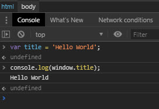

---

# Características de Javascript que deberías saber

<Banner alt="Características de Javascript que deberías saber"/>

<Info />

## Introducción 

Javascript es un lenguaje muy poderoso, con una gran comunidad por detrás, e infinidad de Frameworks o librerías, este lenguaje fue creado por **Brendan Eich** con el nombre de **mocha** (no confundir con el Framework de testing [Mocha](https://mochajs.org/)) mientras se encontraba trabajando en Netscape, no pasaria mucho tiempo para que luego el lenguaje fuera renombrado a **[LiveScript](https://en.wikipedia.org/wiki/JavaScript#Beginnings_at_Netscape)**, luego Netscape seria adquirido por SUN y por una estrategia de marketing el nombre final seria **Javascript**, al mismo tiempo Microsoft saco una version similar conocida como **[Jscript](https://en.wikipedia.org/wiki/JScript)** en su navegador Internet Explorer 3, para evitar que todos los navegadores hicieran versiones similares que llevarían a competir entre ellos, se decidió que lo mejor seria estandarizar el lenguaje, de ahi que la version de javascript 1.1 se envió a la *ECMA* (European Computer Manufacturers Association) que creo el comité *TC39* para estandarizar el lenguaje, asi es como se creo el estándar ECMA-262 en el que se define por primera vez el lenguaje **ECMAScript**, ECMAScript busca estandarizar el lenguaje a usar dentro de los navegadores. Javascript es una implementación del estándar ECMAScript.

Las actualizaciones del estándar son periódicas, se proponen y se revisan posibles nuevas características del lenguaje, ECMAScript con el paso del tiempo a tenido muchas versiones, una de las version mas conocida es la **ECMAScript 2015**, o **ES6**, que es una version de la especificación con muchas mejoras que su antecesora, las nuevas características propuestas que podrían llegar en una nueva version de ECMAScript son conocidas como **ES.NEXT**,

Con esta introducción entendemos un poco mas sobre que es ECMAScript, y por que es importante cuando escribimos código Javascript, en este articulo iremos agregando los features que deberíamos conocer para empezar a crear aplicaciones, ya sea utilizando el estándar(ES5, ES6, ES7, ES8, etc.) o algún Framework, para el desarrollo de aplicaciones del lado del cliente(Angular, Vue, React).

## LET Y CONST (ES6)

Para declarar variables en javascript generalmente utilizamos la palabra reservada **var**, pero al utilizar la palabra var estamos creando una variable global dentro del ámbito de toda la aplicación, pruebe en la consola del navegador hacer lo siguiente:

```js
var title = 'Hello World';
console.log(window.title); // Hello World
```

Como vera al hacer ```console.log(window.title);``` este imprime el valor de la variable title.



otro ejemplo es cuando utilizamos la sentencia **for**:

```js
for(var i = 0; i <= 10; i++) {
  console.log(i); // 1, 2, 3, ... , 10
}
console.log(i) // 11
```
en este caso podemos ver que la variable *i* sigue activa luego de haber finalizado el bucle, regresando el ultimo valor que fue asignado a la variable *i*, esto podria ocasionar errores mas adelante si volvemos a llamar a la variable i global, para evitar este problema nace la sentencia **let**.

```js
for(let i = 0; i <= 10; i++) {
  console.log(i); // 1, 2, 3, ... , 10
}
console.log(i); // ReferenceError: i is not defined
```
como la variable *i* solo existe dentro del ambito del bucle fuera de este causa un error.


**Compártelo en tus redes Sociales!**
<SocialButtons />

<Disqus />