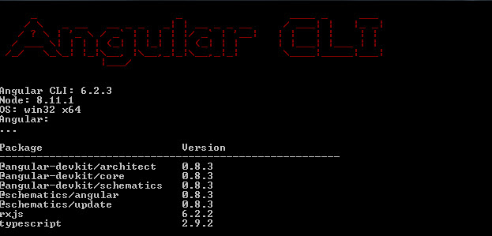
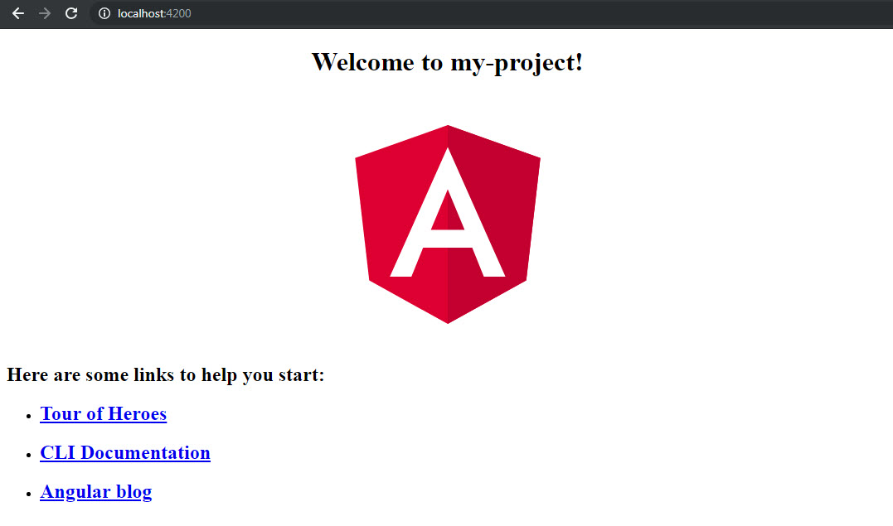

# Start with Angular CLI

<Info />

Welcome, In this post we are going to review the advantages of use Angular CLI in our workflow.


## What is Angular CLI?

Angular CLI allows to create the structure if Angular application, generate services, components, modules, routes, and more, easily and fast.

## Install

What we need to start? Have nodejs installed and npm updated. To install nodejs we can go to [https://nodejs.org](https://nodejs.org).

When node.js has been already installed, we need to update our npm:

```javascript
npm install -g npm // npm update
node --version // verify node version
npm --version // verify npm version
```

Verify that node and npm was updated.

Install Angular CLI is very easy, on the terminal put the next code and press Enter.

```javascript
npm install -g @angular/cli
```

To verify that the was installed successfully, run the command:

```javascript
ng --version
```



And does it! Our Angular CLI was installed correctly.

## Commands

Here we have a list of more important commands to use with Angular CLI.

```javascript
ng help // lista de comandos disponibles
ng new my-project // Crear nuevo proyecto en la carpeta my-project
ng serve // inicia el servidor de desarrollo local http://localhost:4200
ng test // ejecuta los test unitarios usando Karma
ng e2e // ejecuta los test end-to-end usando Protractor
ng build // Genera un compilado, minificado del código.
```

## Create a new project

To create a new project we only need to use the next commands in order:

```Javascript
ng new my-project
cd my-project
ng serve
```

after that, go to the url [http://localhost:4200](http://localhost:4200) to see the application, you can see something like that:



In the next posts we are going to see more tools of Angular CLI, See you!

<Disqus />