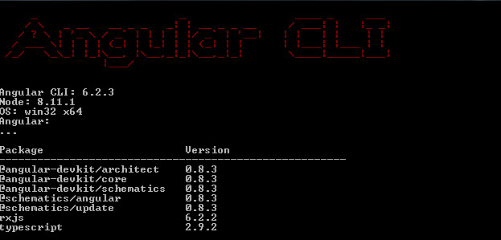
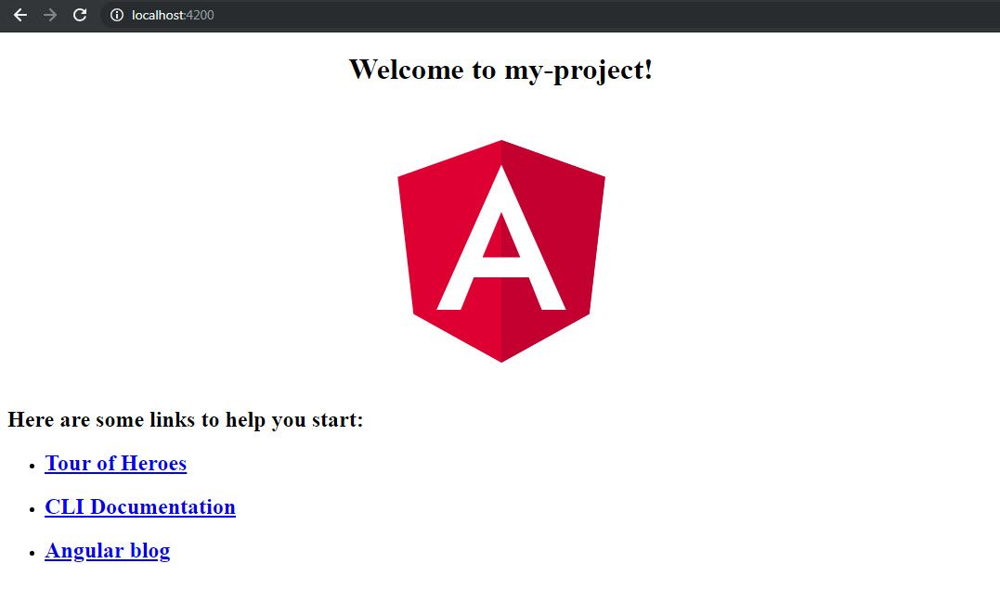

# Iniciando con Angular CLI

Bienvenidos, en este post veremos las ventajas de utilizar Angular CLI dentro de nuestro flujo de trabajo


## Que es Angular CLI?

Angular CLI es una herramienta que nos permite crear la estructura de una aplicación Angular, generar servicios, componentes, módulos, rutas, etc de manera rápida y sencilla.

## Instalación

Que necesitamos? tener nodejs instalado y npm actualizado. Para la instalación de nodejs nos dirigimos a [https://nodejs.org](https://nodejs.org).

Una vez tengamos node instalado, actualizamos nuestro gestor de paquetes de node con el siguiente comando :

```javascript
npm install -g npm // actualización de npm, puede tardar unos minutos
node --version // verificamos nuestra version de node
npm --version // verificamos la version de npm
```

Verificamos que la version de node y npm sea la ultima antes de continuar.

La instalación es muy sencilla, dentro de la linea de comandos ingresamos el siguiente comando y presionamos Enter.

```javascript
npm install -g @angular/cli
```

Una vez finalizado comprobaremos que la instalación se efectuó correctamente con el siguiente comando.

```javascript
ng --version
```
veremos el siguiente mensaje



Y asi nos aseguramos que nuestro Angular CLI se instalo correctamente.

## Comandos principales.

Aquí una lista de los comandos mas importantes para empezar.

```javascript
ng help // lista de comandos disponibles
ng new my-project // Crear nuevo proyecto en la carpeta my-project
ng serve // inicia el servidor de desarrollo local http://localhost:4200
ng test // ejecuta los test unitarios usando Karma
ng e2e // ejecuta los test end-to-end usando Protractor
ng build // Genera un compilado, minificado del código.
```

## Creando un nuevo Proyecto

Para crear un nuevo proyecto de Angular es tan sencillo como ejecutar los siguientes comandos:

```Javascript
ng new my-project
cd my-project
ng serve
```

Luego navegamos a la url [http://localhost:4200](http://localhost:4200) para ingresar a la aplicación, el resultado se vera igual a la siguiente imagen:



En siguientes post veremos aun mas sobre las herramientas que nos ofrece el Angular CLI, hasta Pronto!

<Disqus />